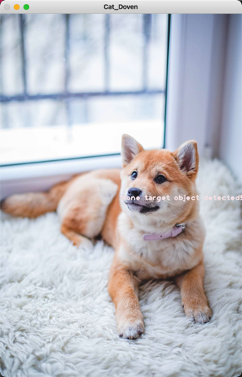
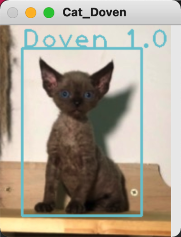
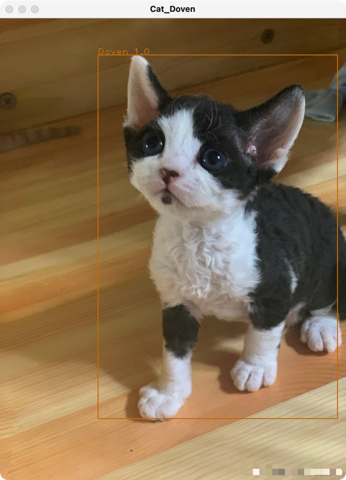

# Cat-Detection-Project-by-YOLO

## Introduction
This reposity is to use YOLO and darknet framework to train a model for object detection.

Find trained weights: https://drive.google.com/file/d/1-08B65Zc-djIUWVJpJ_HPt2cuaCnKCPF/view?usp=sharing
## The story
My friend has a cat recently, and it is a Devon Rex. I learnt a CV algorithm, and it is YOLO. I feel exciting to see what will happen if i apply the YOLO to detect the Devon Rex. Firstly, I collected the picture data of Devon from google(about 150 pic) and manually labeled them. I used Darknet framork to train the model and let's see what I've done.

## Table of Content
* Cat_Doven_Detection.py

-> the program for detection
* /data

-> the target pictures and video
* /test

-> demo pictures and video

### Demo of video detection:

## Reference:
labelImg: https://tzutalin.github.io/labelImg/

Darknet: https://github.com/AlexeyAB/darknet

dog1.jpeg source: https: // www.pexels.com / photo / brown - and -white - short - coated - puppy - 1805164 /
